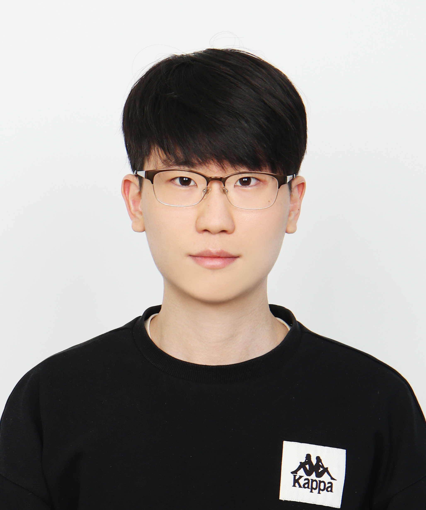

  
  

    Byoungho Son  
    Ph.D. student @ POSTECH  
    email: bhson99 at gmail dot com  
  

Hello, there!
I am (potentially) a graduate student pursuing a Ph.D. at POSTECH. 
Befored that, I got my bachelor's degree in CS and mathematics at Sogang University.
Currently, I (potentially) study software verification and computational logic at Software Verification Lab, advised by Kyungmin Bae.
I am broadly interested in formally reasoning about software thereby achieving reliability. 
I am mostly happy when two seemingly different things turn out to be the same.

## Interests
In general, Model Checking, Computational Logic, Automated Reasoning, Type Theory. In particular,
(will be added soon!).

## Education
* (2022 Aug - present) Ph.D. in Computer Science. POSTECH. (advisor: Kyungmin Bae)
* (2018 Feb - 2022 Aug) B.E. in [Computer Science and Engineering](https://cs.sogang.ac.kr/cs/index_new.html) 
  & B.S. in [Mathematics](https://math.sogang.ac.kr/math/index_new.html) (Double Major). Sogang University.

## Experience
* (2022 Aug - present) Graduate Researcher. Software Verification Lab. POSTECH.
* (2021 Jul - 2022 Jan) Undergraduate Reasearch Intern. [ProsysLab](https://prosys.kaist.ac.kr). KAIST. (Advisor: [Kihong Heo](https://kihongheo.kaist.ac.kr))

## Project
I have contributed to the following open-source projects:
* TakeThis: Undergrad. Capstone Project @ Sogang University
* software vulnerability detection system (details will be added later)

## Publication
* TakeThis: A University Course Recommendation System Based on Domain-Specific Concept Similarities
[pdf](/assets/publications/TakeThis.pdf) 
[project page](http://cscp2.sogang.ac.kr/CSE4187/index.php/TakeThis)
* Detecting software vulnerabilities by static analysis (submitted)

## Honours & Awards
* (2018) Albatross SW Scholarship, Sogang University
* (2018 Spring) Dean's List, Department of Engineering, Sogang University.

## Contact
* email - bhson99 at gmail dot com
* github - [github.com/byhoson](https://github.com/byhoson)
