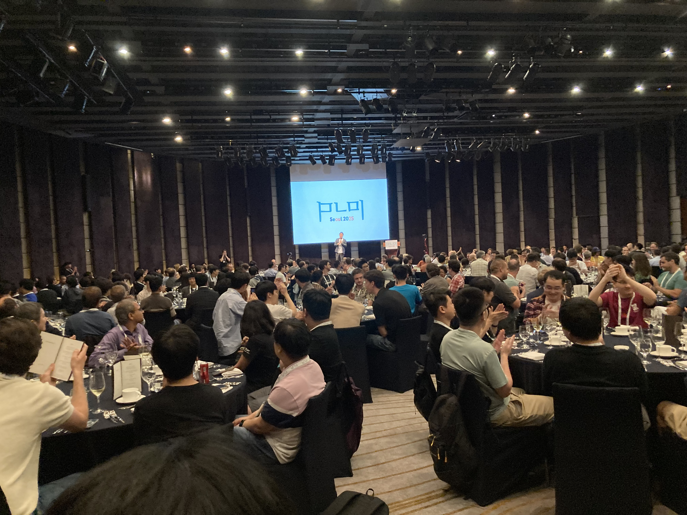
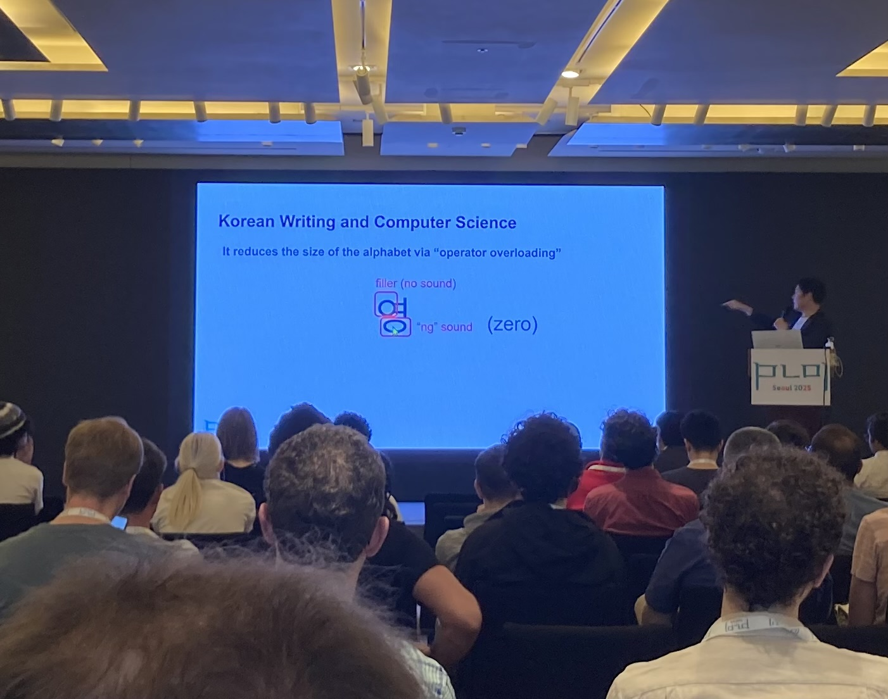
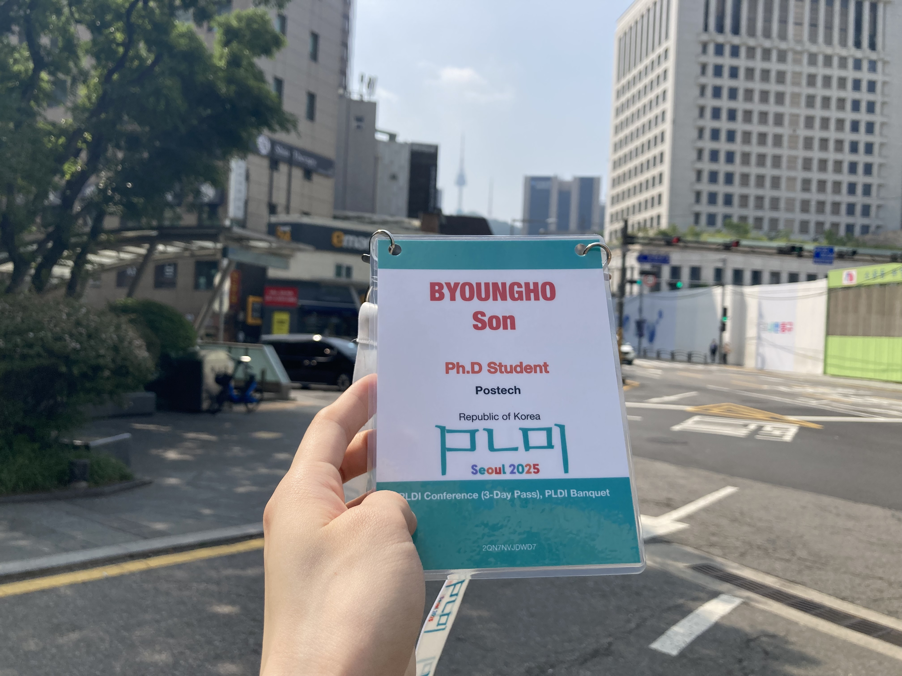
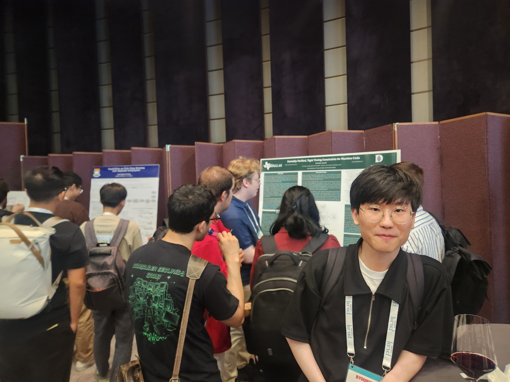

# PLDI 2025 (2025.6.18-2025.6.20, 서울) 여행기
## 개요
PLDI(Programming Language Design and Implementation)는 POPL과 함께 프로그래밍 언어분야의 양대산맥으로 여겨지는 국제학회로,
매년 해당분야의 세계최고 수준의 연구자들이 한데 모이는 교류의 장 역할을 한다.
올해에는 PLDI 역사상 최초로 한국인(허충길 교수님)이 General Chair를 맡고 한국에서 개최되었기에 그 의미가 남다르다.
무엇보다 나 개인적으로 세계최고의 학회를 (논문 없이) 처음으로 경험하는 순간이었기에 그 의미가 더더욱 남다르다고 할 수 있겠다.

<figure>

<figcaption>둘째날 뱅킷에서 시상식을 앞두고 허충길 교수님께서 마이크를 잡은 모습</figcaption>
</figure>

## 흥미로웠던 발표
### Active Learning of Symbolic NetKAT Automata [(link)](https://dl.acm.org/doi/10.1145/3729295)
이 논문은 코넬대학교에서 주로 연구되고 있는 NetKAT 프로젝트의 일환으로서 발표되었다.
NetKAT은 최근들어 오토마타 분야에서 굉장히 중요하게 연구되고 있는 KAT(Kleene Algebra with Tests)이라는 대수적 구조를 네트워크 분석에 응용할 수 있도록 확장한 것이다.
네트워크 상에서의 패킷의 움직임을 NetKAT의 형식언어(Formal Language)로 표현하고, 이를 억셉하는 NetKAT 오토마톤을 정의하면,
오토마타 동등성을 검사 하는 등 다양한 모델체킹을 수행함으로써 네트워크를 Control Plane 수준에서 분석할 수 있게되는 컨셉이다.

이 논문의 핵심은 네트워크라는게 워낙 방대하다보니, 네트워크의 토폴로지 및 개별 스위치의 라우팅 정책 등을 손수 한땀한땀 NetKAT으로 모델링하는 것이 비현실적이라는 관찰에 기반한다.
보통 이런 상황에서는 외부적으로 관찰되는 개별 트레이스들로부터 (오토마톤) 모델을 자동으로 학습하는 능동학습(Active Learning) 접근을 생각할 수 있는데,
이 논문이 정확히 그런 접근을 취한다.
즉, 능동학습의 대표격인 Angluin의 L* 알고리즘을 NetKAT 오토마타에 맞춰 변형한 연구라고 할 수 있겠다.

사실 학회에 참가하기전 가장 관심있었던 논문이 이 논문이었다.
NetKAT이나 네트워크 검증 자체에 대한 특별한 관심이 있었다기 보다는,
이러한 계열의 연구가 내가 생각하기에 가장 이상적인 방식으로 이론과 응용 사이를 아우르는 것 같았기 때문이다.
NetKAT의 역사를 타고 들어가면 Dexter Kozen, Alexandra Silva 등이 이름이 나오는데,
이들은 범주론(Category Theory)으로 오토마타 등의 구조를 공부하는 Coalgebra 커뮤니티에서 굉장히 유명하다.
이들의 접근에 따르면, 오토마톤, 마르코프결정과정(MDP), 라벨전이시스템(LTS) 등 상태변화를 표현하는 개별 프레임워크는 그에 맞는 펑터를 정의함으로써 얻어지는 Coalgebra로 하나의 프레임워크로서 추상화된다.
그렇게되면, 하나의 프레임워크에서 작동하는 개별 알고리즘 또한 추상화되어 전혀 다른 프레임워크에서 작동할 수 있도록 변형될 수 있는 여지가 생긴다.
나는 이 논문 또한 이러한 인사이트가 매우 중요하게 작용하지 않았을까 짐작한다.
즉, NetKAT 오토마타를 위한 모델학습 알고리즘을 처음부터 고민할 것이 아니라,
기존에 존재하는 L* 알고리즘을 추상화한 후 NetKAT의 특성에 맞게 "파인튜닝"하는 식으로 접근하지 않았을까 싶다.
어쩌면 이 세상의 수많은 알고리즘들은 단지 "구조"라는 단일한 실체의 개별 "그림자"뿐이지 않을까.

발표를 듣기 전 우연히 이 논문의 공동저자 중 한명인 Tiago와 짧게 대화할 기회가 있었다.
본인의 연구에서 Coalgebra 적인 접근이 중요하냐고 물었더니, 매우 그렇다고 한다.
내가 하는 연구도 간략히 소개했다.
모델체킹 연구에 강화학습을 적용하는 접근을 한다고 했더니,
능동학습과는 달리 알고리즘에 Soundness 등 Guarantee를 주기가 힘들 것 같다고 했다.
지극히 예상되는 답변이었다.
머리가 복잡해졌다.

### StacKAT: Infinite State Network Verification [(link)](https://dl.acm.org/doi/10.1145/3729257)
이 논문 또한 코넬대학교에서 진행한 NetKAT 기반의 연구였다.
기존의 NetKAT에서는 네트워크 패킷이 유한한 레코드 타입으로 표현되는데,
이를 무한한 상태공간에 대해서도 적용 가능하도록 StackKAT이라는 언어로 확장한 연구였다.

논문의 내용은 다음과 같다.
NetKAT에서는 패킷을 유한한 레코드 `h`로 표현했다면, StacKAT에서는 여기에 스택을 덧붙인 `<h,s>`로 표현한다.
여기서 추가된 스택 `s`는 전체 패킷에서 아직 파싱되지 않은 일종의 continuation으로 볼 수 있겠다.
그리고 이 스택을 조작하기 위해 NetKAT의 문법에 `push(v)` 및 `pop(v)`을 추가함으로써 StacKAT 언어를 정의한다.
그런 후 두 StacKAT 언어의 동등성을 검사하는 알고리즘을 제안한다.
이 알고리즘은 당연히 무한 상태의 네트워크를 모델링하는 StacKAT과,
그 요구사항을 표현하는 StacKAT 사이의 동등성을 검사하는 방식으로 검증에 활용될 수 있다.

놀라운 것은 이 두가지 기능을 추가했음에도 불구하고 기존 NetKAT에서 가능했던 동등성 검사의 Decidability가 깨지지 않는다는 것이다.
이게 당연한 것이 아니라는 것은 학부 오토마타 수업에서 배우는 Regular Language(RE)와 Context-Free Language(CFL)를 비교해보면 알 수 있다.
알려져 있다시피, 이들은 각각 유한 오토마타(FA)와 여기에 스택을 추가한 푸시다운 오토마타(PDA)에 의해 정의되는 언어들이다.
PDA가 스택을 도입함으로써 지불해야하는 비용은 꽤 큰데, 바로 RE에서는 결정가능(Decidable)했던 동등성 검사가 CFL에서는 결정불가능(Undecidable)해진다는 점이다.
물론, 이러한 CFL의 알고리즘적 제약을 보완하기 위해 스택을 조작하는 방식에 좀더 제한을 가해서 동등성 검사를 결정가능하게 만든 Visibly Pushdown Language(VPL)라는 것이 2000년대 초반 나오기도 했다.
StacKAT은 스택의 조작에 아무 제약이 없는데도 동등성이 결정가능한 것은 그래서 놀랍다.

이 논문의 발표는 위에서 다뤘던 Active Learning of Symbolic NetKAT Automata의 바로 다음 순서로 진행됐는데,
이들을 포함하여 총 세개의 발표가 연달아 같은 그룹에서 Kleene Algebra라는 공동의 키워드로 발표된 것이 굉장히 인상깊었다.
아니, 애초에 이들 발표를 포괄하는 세션 이름 자체가 "Big Red KATs"였다.
질의응답도 자기들끼리 하더라.
좋은 연구는 그저 한편의 논문이 아니라 하나의 "분야"를 탄생시킬 수 있다는 것을 배웠다.
참고로 KAT이라는 "분야"의 창시자는 Dexter Kozen이라는 사람인데, 내가 들었던 계산이론 수업에서 쓰였던 주교재의 저자여서 반갑기도 했다.
저 사람들이 부러웠다.

## 서울
보통 학회 여행기를 보면 학회가 열린 도시의 관광 명소나 로컬 음식을 소개하면서 마무리하는 것 같은데,
불행인지 행운인지 이번에는 역사상 처음으로 PLDI가 서울에서 열렸다.
따라서 나로서는 문화체험의 당사자보다는 문화의 설파자의 위치에 등극했다.
출생 이후 대학원 진학 전까지 약 25년 간 살았던 고향(?)에서 지구 반대편의 연구자들을 맞이한다는 것은 영광이 아닐 수 없다.
게다가 학회장의 위치가 집에서 2호선 타면 정확히 두 정거장 거리이기도 했으니 기분이 묘했다.

물론 이러한 자의식 과잉에 비해 나는 한 일이 없고, 서울대 허충길 교수님께서 마치 올림픽과 비견될 정도의 훌륭한 호스트 역할을 해주셨다.
둘째날 Business Meeting 세션이 특별히 기억에 남는다.
주제는 "Korean Writing and Computer Science"였다.
대단히 심오한 발표는 아니였고, 일종의 15분짜리 꽁트에 가까웠다.
허충길 교수님의 주장에 의하면, 한글은 PL관점에서 훌륭한 형식언어이다.
우선 대단히 조립적(Compositional)이다.
예를 들어 `한글`은 `ㅎ+ㅏ+ㄴ+ㄱ+ㅡ+ㄹ`로 음소(Phoneme) 수준에서 분해될 뿐만 아니라,
개별 음소 또한 `ㅑ = ㅏ + ·` 등으로 한번더 분해된다는 것이다.
반대로 분해된 개별 시퀀스에서 원래 글자를 합성하는 것도 가능하다.
예를 들어 자판에 `ㅎ+ㅏ+ㄴ+ㄱ+ㅡ+ㄹ`라고 치면 자동으로 `한글`로 나타난다.
이는 한글이 DFA(Deterministic Finite Automata)로 파싱가능하다는 것을 의미한다.
특히 한글에서 첫 글자에 오는 `ㅇ`은 받침 `ㅇ`과 'operator overloading'되어 파싱의 ambiguity를 해소한다.
바로 이 덕분에 우리가 모바일에서 10개 내외의 자판을 이용해서 타이핑할 수 있는 것이다.
가히 세종대왕은 한국 최초의 (어쩌면 세계 최초의) 컴퓨터과학자라 할 수 있겠다.

허충길 교수님께서 PL의 용어를 남발하며 한글의 우수성을 설파할 때마다 30초 마다 곳곳에서 웃음보가 터졌다.
PL로 사람들을 웃길 수 있다는 것, 게다가 동시에 발표를 듣는 한국인에게 '국뽕'을 선사할 수 있다는 것은 대단한 능력인 것 같다.
이러한 분들이 한국에 존재한다는 것은 국가적으로 큰 행운임이 틀림없다.
미래 언젠가는 PLDI 뿐만 아니라 내가 속한 검증 분야의 세계최고학회인 CAV도 한국인 chair가 등장할 날이 올지 모르겠다.

<figure>

<figcaption>허충길 교수님께서 진행한 Korean Alphabet 101 </figcaption>
</figure>

## 마치며
통합과정 3년차 막바지에 처음으로 세계최고수준의 학회를 경험했다.
내가 얻은 것은 마음의 충격이었다.
학회에 온 모든 사람들이 나보다 최소 100배는 훌륭한 연구자라는 것을 뒤늦게 알아버렸기 때문이었다.
더 늦게 왔으면 큰일날 뻔했다.

정진해야겠다.

PLDI 2025에 참여할 수 있도록 금전적으로 지원해주신 배경민 교수님, 그리고 동행한 연구실 동료들에게 감사의 말씀을 전한다.
<figure>

<figcaption>집에서 두 정거장 거리에서 월클에 둘러싸인 나 </figcaption>
</figure>
